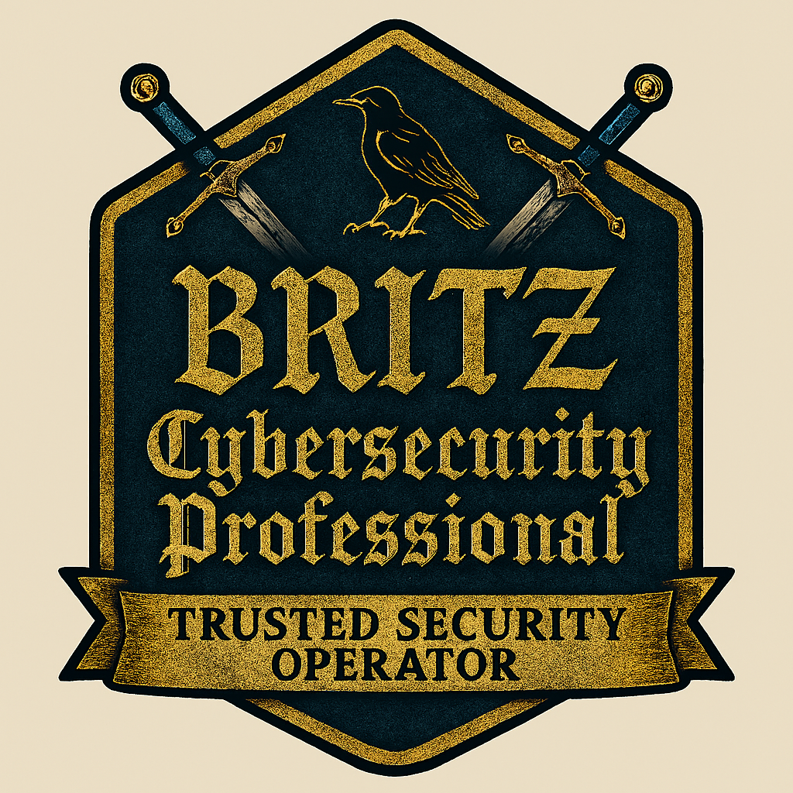

  

# CONTRIBUTING & OPERATIONAL STANDARD

---

## 1. Purpose
This repository is my **public proof of discipline and technical authority**.  
Every commit strengthens the brand, the governance model, and the operational integrity it represents.

---

## 2. Operating Mindset
- Treat every addition as **executive‑facing evidence**.  
- Maintain **brand uniformity** in visual and written artifacts.  
- Enforce **evidence hygiene** — no clutter, no guesswork, no drift from standards.

---

## 3. Branch Strategy
- `main` — **protected**; always production‑grade, audit‑ready.
- Feature work is developed locally, verified, and merged **only when governance is satisfied**.
- No “work in progress” commits in `main`.

---

## 4. Commit Discipline
- Write strong, **imperative commit messages**.
- Capture the “why” as well as the “what”.
- Avoid noisy or cosmetic commits unless they reinforce brand or governance.

---

## 5. Documentation Protocol
- Every new directory includes a `README.md`:
  - Purpose
  - Governance reference
  - Expected contents
- Apply **approved templates** from `/governance/` without deviation.

---

## 6. Security & Compliance
- Never commit secrets, live credentials, or client identifiers.
- Evidence is **sanitised** before inclusion.
- `.gitignore` is actively maintained to block sensitive spillover.

---

## 7. Continuous Audit
- Self‑review every merge against:
  - Technical accuracy
  - Brand and crest usage
  - Governance alignment
- Non‑compliant content is removed without exception.

---

> **This is not just a repo — it is a signature project.  
> Every commit is a statement of capability, control, and legacy.**
